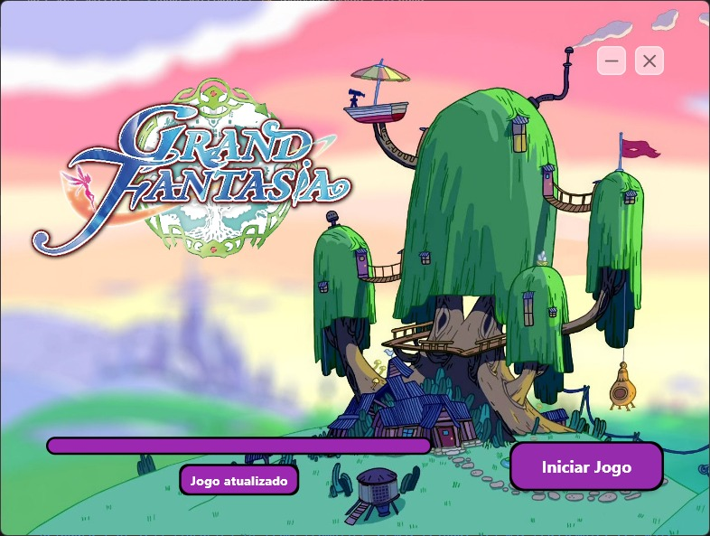

# Grand Fantasia Launcher

Launcher para o jogo Grand Fantasia (Dream Journey Online).


*Imagem da versão atual do launcher*

### Próximos Passos

Em uma versão futura pretendo adicionar uma área de WebView no launcher, onde será possível exibir quaisquer informações sobre manutenções ou qualquer outro tipo de conteúdo pertinente ao jogo.


*Imagem da próxima versão planejada do launcher*

## Requisitos

Para compilar este projeto é necessário ter as seguintes ferramentas instaladas:

* Visual Studio 2022 (apenas para instalação e configuração de dependencias)
* Qualquer editor de texto (utilizei o VS Code)
* Flutter
* Enigma Virtual Box (opcional, mas bem útil)

Para um tutorial de instalação do Flutter, acesse este [link](https://docs.flutter.dev/get-started/install/windows/desktop).

## Projetos

Neste repositorio existem dois projetos, o primeiro e mais importante é o launcher, que se encontra na pasta [grand_fantasia_launcher](./grand_fantasia_launcher/), o segundo projeto é um programa para atualizar o launcher e se encontra na pasta [grand_fantasia_launcher_updater](./grand_fantasia_launcher_updater/).

### grand_fantasia_launcher_updater

Como já foi dito, este programa é o responsável por atualizar o arquivo do launcher, sua execução é feita pelo próprio launcher.

Para compilar o programa e gerar um arquivo executavél (.exe) utilize o comando abaixo na raiz do projeto:

```
dart compile exe .\bin\grand_fantasia_launcher_updater.dart -o launcher_updater.exe
```

O comando acima dará origem a um arquivo 'launcher_updater.exe' na [raíz](./grand_fantasia_launcher_updater/) do projeto grand_fantasia_launcher_updater.

### grand_fantasia_launcher

O principal projeto deste repositorio, busca um arquivo de versão em um servidor de arquivos e posteriormente, se necessário, baixa um zip contendo atualizações e extrai seu conteúdo na pasta em que está localizado. Para executar/compilar este projeto, é necessário definir um arquivo .env na [raíz](./grand_fantasia_launcher/) do projeto, com algumas váriaveis necessárias:

```
VERSION_URL=URL_DO_ARQUIVO_DE_VERSÃO
UPDATE_URL=URL_DO_ARQUIVO_ZIP_DE_ATUALIZAÇÃO
EXE_FILE_NAME=NOME_DO_executável_DO_JOGO
LAUNCHER_FILE_NAME=NOME_DO_executável_DE_LAUNCHER
LAUNCHER_UPDATER_FILE_NAME=NOME_DO_executável_DE_ATUALIZADOR_DE_LAUNCHER
```

Após a criação deste arquivo, basta compilar o projeto com o comando abaixo:

```
flutter build windows
```

O resultado da compilação será uma lista de arquivos (executável e dll's) dentro da pasta em [build/windows/x64/runner/Release/](./grand_fantasia_launcher/build/windows/x64/runner/Release/).

#### Opcional

Faça o merge do executável e das dll's utilizando o programa [Enigma Virtual Box](https://enigmaprotector.com/en/downloads.html), um tutorial pode ser visto [aqui](https://www.youtube.com/watch?v=LEk2Ry5ERZQ&t=93s).

## Utilização

Para utilizar o launcher, basta colocar o executável e dll's gerados em ambos os projetos (se você fez o passo opcional então serão apenas dois executaveis) na pasta do jogo, executar e esperar a mágica acontecer.
